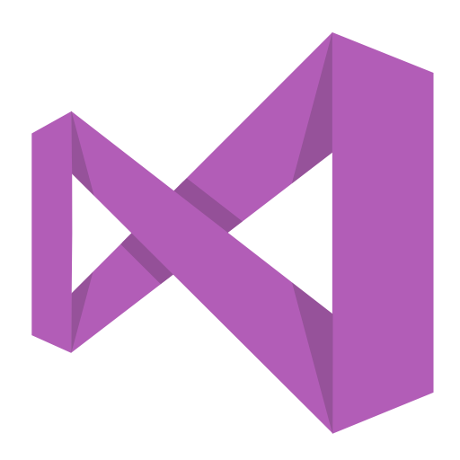
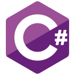
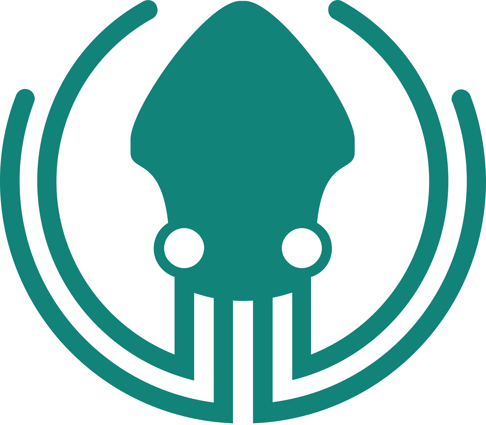

### Connect with me:

[][telegram]
[][vk]
[][steam]
  

---
### Languages and Tools:

[][vs2019]
[][vsCode]
[][stack]
[][dotnet]
[][charp]
[][unity]
[][hololens]
[][git]
[][gitKraken]
[][github]
  
  

---

 

 

[telegram]: https://t.me/D_o_r_G
[vk]: https://vk.com/d_o_r_g
[vsCode]: https://code.visualstudio.com/
[vs2019]: https://visualstudio.microsoft.com/
[github]: https://github.com/D0rG
[git]:https://git-scm.com/
[unity]: https://unity.com
[charp]: https://docs.microsoft.com/ru-ru/dotnet/csharp/
[stack]: https://stackoverflow.com/
[gitKraken]: https://www.gitkraken.com/
[steam]: https://steamcommunity.com/id/D0rg/
[spotify]: https://open.spotify.com/user/9c0tr900ev5zza2v84ae1b74k?si=2pX2ejBwQGWj2htx0FFACg
[hololens]:https://github.com/microsoft/MixedRealityToolkit-Unity
[dotnet]:https://dotnet.microsoft.com/